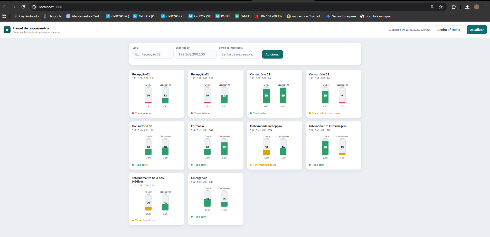

# 🖨️ Painel de Suprimentos — Monitor de Impressoras

Painel web para monitorar o nível de **toner** e **cilindro** de impressoras Brother em rede, desenvolvido para uso real em ambiente hospitalar.

Em vez de abrir o navegador impressora por impressora e digitar senha em cada uma, o programa consulta todas de uma vez e exibe um painel visual com alertas por cor.



---

## ✨ Funcionalidades

- 📊 **Gauges visuais** de toner e cilindro com código de cores (verde / amarelo / vermelho)
- ➕ **Adicionar e remover** impressoras pela própria interface, sem editar código
- 🔑 **Gerenciamento de senha** por impressora ou para todas de uma vez
- ⚡ **Consulta em paralelo** — todas as impressoras são verificadas simultaneamente
- 🔒 **Senhas nunca expostas** na interface (campo `type="password"`, API não retorna senhas)
- 🩺 **Script de diagnóstico** para depurar impressoras que não respondem

---

## 🛠️ Stack

| Camada | Tecnologia |
|--------|-----------|
| Coleta de dados | **SNMP** (Python puro, sem bibliotecas externas) + **HTTP scraping** com login |
| Backend / API | **Python + Flask** |
| Frontend | **HTML + CSS + JavaScript** (vanilla, sem frameworks) |
| Persistência | **JSON** (lista de impressoras) |

---

## 🏗️ Arquitetura

O projeto segue separação clara em 3 camadas:

```
monitor_web/
├── snmp_engine.py        # Camada de dados  — fala com as impressoras
├── app.py                # Camada de lógica — servidor Flask + REST API
├── templates/
│   └── index.html        # Camada de interface — painel no navegador
├── impressoras.json      # Lista de IPs (não versionada — contém dados sensíveis)
├── impressoras.exemplo.json  # Template para configuração inicial
├── diagnostico.py        # Utilitário de diagnóstico de rede
├── iniciar.bat           # Inicialização no Windows
└── requirements.txt
```

### Como os dados chegam

```
Impressora (rede local)
    │
    ├── UDP 161 (SNMP)  ──► snmp_engine.py  ──► % cilindro (sempre disponível)
    │                                         └► % toner (se disponível via SNMP)
    │
    └── HTTPS (login automático) ─► snmp_engine.py ──► % toner (fallback quando
                                                         SNMP não retorna %)
                                                         
snmp_engine.py ──► app.py (Flask) ──► /api/status ──► index.html (painel)
```

**Por que dois protocolos?** As Brother DCP-L5512DN retornam o cilindro via SNMP normalmente, mas o toner reporta `-3` (código padrão: "tem suprimento, sem % numérica"). O programa faz login automático na página de manutenção da impressora para obter o número real.

---

## 🚀 Como rodar

### Pré-requisitos
- Python 3.8+ com `pip`
- Rede local com acesso às impressoras

### Windows (mais simples)
```
1. Clone ou baixe o repositório
2. Copie impressoras.exemplo.json para impressoras.json e edite com seus IPs
3. Dê dois cliques em iniciar.bat
4. O navegador abre automaticamente em http://localhost:5000
```

### Linux / macOS
```bash
pip install flask
cp impressoras.exemplo.json impressoras.json
# edite impressoras.json com seus IPs
python app.py
```

### Acessar de outra máquina na rede
O servidor sobe com `host=0.0.0.0`, então qualquer máquina na rede pode acessar via `http://IP-DESTE-PC:5000`.

---

## 📡 API REST

| Método | Rota | Descrição |
|--------|------|-----------|
| `GET` | `/api/impressoras` | Lista impressoras (sem senhas) |
| `POST` | `/api/impressoras` | Adiciona `{ local, ip, senha }` |
| `DELETE` | `/api/impressoras/:ip` | Remove pelo IP |
| `PUT` | `/api/impressoras/:ip/senha` | Atualiza senha de uma impressora |
| `PUT` | `/api/senha-todas` | Aplica mesma senha a todas |
| `GET` | `/api/status` | Consulta nível de suprimentos ao vivo |

---

## 🔧 Diagnóstico

Se uma impressora não responder, rode o diagnóstico:

```bash
python diagnostico.py
```

Ele sonda a impressora (SNMP + HTTP), imprime o que recebe e salva num arquivo `.txt` — sem gravar a senha.

---

## 💡 Contexto de desenvolvimento

Projeto desenvolvido para resolver um problema real: a equipe de TI de um hospital precisava verificar o nível de toner de 10 impressoras toda semana, o que exigia abrir o navegador em cada uma, aceitar o certificado HTTPS autoassinado, digitar a senha e navegar até a página de manutenção.

Desafios técnicos encontrados:
- As impressoras usam SNMP mas retornam código `-3` para o toner (sem % numérica)
- O HTTPS usa certificado autoassinado — foi necessário ignorar a validação SSL
- O formulário de login varia entre firmwares — o programa lê o form automaticamente
- Consulta paralela com `ThreadPoolExecutor` para não travar o servidor aguardando timeout

---

## 📋 Próximas melhorias planejadas

- [ ] Histórico de leituras com gráfico de consumo (SQLite + Chart.js)
- [ ] Alerta automático por e-mail quando toner cair abaixo do limite
- [ ] Agrupamento de impressoras por setor
- [ ] Atualização automática periódica do painel
- [ ] Investigar diferença de ±1% no cilindro entre SNMP e página web

---

## 📄 Licença

MIT — use, adapte e distribua livremente.
